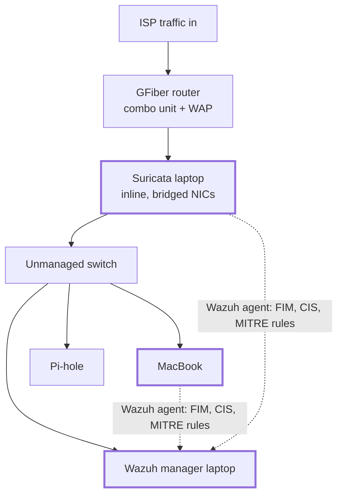

# wazuh-siem-homelab

A self-hosted Wazuh SIEM/XDR stack, deployed with Docker Compose and configured through Ansible. Agents on hardened Linux hosts provide file integrity monitoring, CIS security configuration assessment, and detection rules mapped to MITRE ATT&CK. Terraform provisions the AWS-side log delivery (S3 + SQS with scoped IAM) so the same SIEM ingests CloudTrail and GuardDuty from the aws-secure-baseline account. one correlation point for on-prem and cloud. The write-up covers rule tuning, false-positive triage, and what I alert on versus suppress.

## Physical Homelab Implementation

### Hardware
- Rapsberry Pi 2 Model B
- Laptop 1 - Running Surricata
- Laptop 2 - Running Wazuh
- GFiber Router+Modem-Combo device
- TPLink Unmanaged Switch

### Architecture

### CIS Configurations

Through the Wazuh Dashboard, I found that there are ~100 critical vulnerabilities on the two laptops running Ubuntu based on the CIS benchmarks.

Following is the plan for hardening these machines, using the Wazuh dashboard report as a proxy for progress:

