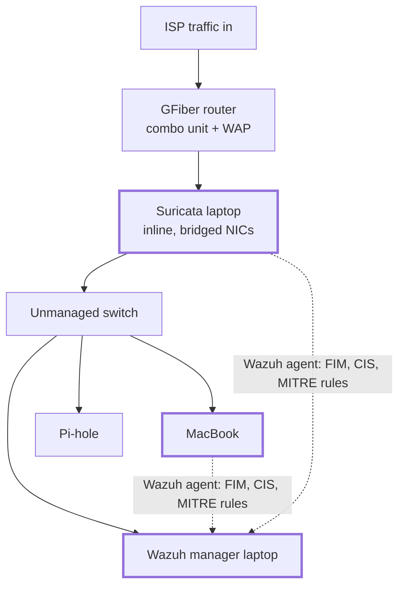

# Wazuh SIEM & XDR Homelab

A production-styled Wazuh deployment that treats a home network the way a SOC
treats an enterprise: agents everywhere, cloud telemetry in the same pane, and
every detection decision written down.

## Physical Homelab Implementation

### Hardware
- Rapsberry Pi 2 Model B
- Laptop 1 - Running Surricata
- Laptop 2 - Running Wazuh
- GFiber Router+Modem-Combo device
- TPLink Unmanaged Switch

## What it does
- **SIEM/XDR core** deployed with Docker Compose (indexer, manager, dashboard),
  configuration managed through Ansible rather than console clicks
- **Endpoint coverage:** Wazuh agents on hardened Linux hosts providing file
  integrity monitoring, CIS security configuration assessment, and detection
  rules mapped to MITRE ATT&CK
- **Cloud ingestion:** Terraform provisions the AWS log-delivery path
  (S3 + SQS with scoped IAM) so the same SIEM correlates CloudTrail and
  GuardDuty findings alongside on-prem alerts
- **Tuning as a deliverable:** documented rule tuning and false-positive
  triage — what I alert on, what I suppress, and why

## Why it's built this way
A SIEM you only installed proves nothing; the signal is in the decisions.
Each detection documents the threat it catches, the noise it generates,
and the tuning applied. Alert-to-suppression reasoning lives in
[`docs/tuning-log.md`](docs/tuning-log.md).

## Stack
Wazuh · Docker Compose · Ansible · Terraform · AWS (S3, SQS, IAM,
CloudTrail, GuardDuty) · MITRE ATT&CK

## Status & roadmap
- [x] Core stack deployed via Docker Compose
- [x] Linux agents enrolled with FIM + SCA policies
- [ ] CloudTrail/GuardDuty ingestion pipeline (Terraform)
- [ ] Python alert-enrichment script (threat-intel lookups on source IPs)
- [ ] Full tuning writeup

### Architecture

### CIS Configurations

Through the Wazuh Dashboard, I found that there are ~100 critical vulnerabilities on the two laptops running Ubuntu based on the CIS benchmarks.

Following is the plan for hardening these machines, using the Wazuh dashboard report as a proxy for progress:

