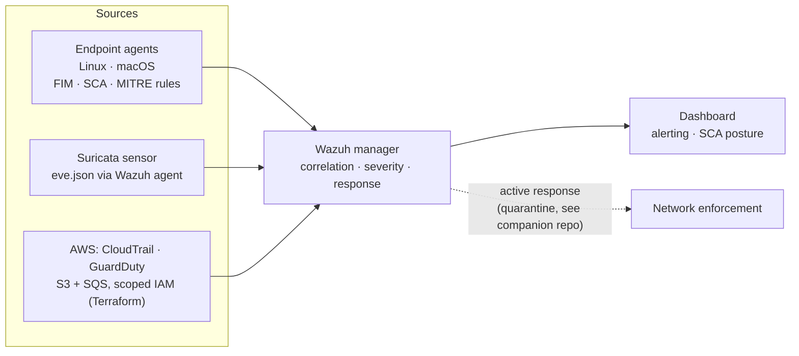

# Wazuh SIEM & XDR Homelab

A production-styled Wazuh deployment that treats a home network the way a SOC
treats an enterprise: agents everywhere, cloud telemetry in the same pane, and
every detection decision written down.

> Companion repos: [`segmented-network-ids-lab`](../segmented-network-ids-lab)
> (the network this SIEM monitors: VLAN zones, pfSense policy, Suricata sensor) ·
> [`hardened-linux-image-pipeline`](../hardened-linux-image-pipeline)
> (build-time hardening that this SIEM verifies at runtime)

## What it does

- **SIEM/XDR core** deployed with Docker Compose (indexer, manager, dashboard),
  configuration managed through Ansible rather than console clicks
- **Endpoint coverage:** Wazuh agents across Linux and macOS providing file
  integrity monitoring, CIS security configuration assessment (SCA), and
  detection rules mapped to MITRE ATT&CK
- **Network detection ingestion:** Suricata alerts (`eve.json`) ship from the
  sensor's Wazuh agent to the manager for correlation with host telemetry,
  creating one alert stream for network- and host-level detections
- **Cloud ingestion:** Terraform provisions the AWS log-delivery path
  (S3 + SQS with scoped IAM) so the same SIEM correlates CloudTrail and
  GuardDuty findings alongside on-prem alerts
- **Tuning as a deliverable:** documented rule tuning and false-positive
  triage covering what I alert on, what I suppress, and why

## Where it runs

The SIEM sits on the segmented network documented in the
[companion repo](../segmented-network-ids-lab): the Wazuh manager
(Dell Latitude, Ubuntu + Docker) lives in the management VLAN alongside
pfSense and the managed switch; the Suricata sensor (Dell Latitude, Proxmox)
watches inter-zone traffic from a SPAN port; agents run on endpoints across
the trusted zones. Network design decisions live there. This repo covers
what the SIEM does with the telemetry.

## Telemetry flow

## CIS hardening: measured, not claimed

Wazuh's SCA module benchmarked both Ubuntu hosts against CIS: the initial
scan surfaced **~100 failed checks per host**. That baseline is the
"before". The SCA dashboard becomes the progress metric, re-scanned after
each remediation batch.

Remediation plan, in priority order:

1. **Baseline capture:** initial SCA reports exported as artifacts
   ([`docs/sca-baseline/`](docs/sca-baseline/))
2. **Triage failed checks** into three buckets: remediate now (auth, SSH,
   logging, kernel), remediate via automation, and accept-with-reasoning,
   where each accepted finding documents the risk and why
3. **Remediate through the shared Ansible CIS role** from the
   [golden-image pipeline](../hardened-linux-image-pipeline), proving the
   role works on live systems, not just fresh builds
4. **Re-scan and diff:** the before/after delta is the deliverable
5. **Continuous verification:** scheduled SCA runs surface configuration
   drift as a dashboard regression, not a surprise

## Why it's built this way

A SIEM you only installed proves nothing; the signal is in the decisions.
Each detection documents the threat it catches, the noise it generates,
and the tuning applied. Alert-to-suppression reasoning lives in
[`docs/tuning-log.md`](docs/tuning-log.md).

## Stack

Wazuh · Docker Compose · Ansible · Terraform · AWS (S3, SQS, IAM,
CloudTrail, GuardDuty) · Suricata · MITRE ATT&CK · CIS Benchmarks

## Status & roadmap

- [x] Core stack deployed via Docker Compose
- [x] Linux + macOS agents enrolled with FIM + SCA policies
- [x] CIS SCA baseline captured (~100 failed checks per Ubuntu host)
- [x] Suricata `eve.json` ingestion from the network sensor
- [ ] SCA triage: remediate / automate / accept-with-reasoning
- [ ] CIS remediation via shared Ansible role, with before/after scores
- [ ] CloudTrail/GuardDuty ingestion pipeline (Terraform)
- [ ] Python alert-enrichment script (threat-intel lookups on source IPs)
- [ ] Full tuning writeup
